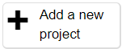
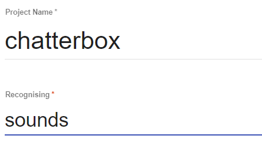
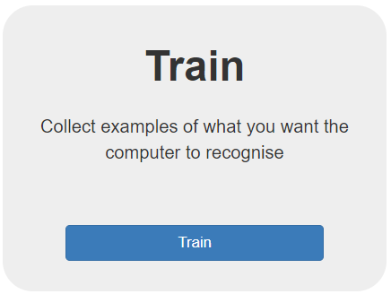
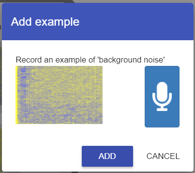

## Create your machine learning model

Imagine you're trying to cut down on hotdogs and eat more healthily. This detector can help keep you on track by alerting you whenever a sneaky hotdog is on your plate! (In case you couldn't tell!)

First, create your machine learning model on Machine Learning for Kids:

--- task ---

Open the website [Machine Learning for Kids](https://machinelearningforkids.co.uk/#!/login){:target="_blank"}.

--- /task ---

--- task ---

In the screen that appears, choose **Log In** if your mentor gave you some login details. Enter your username and password on the next screen.

Choose **Sign Up** if you are creating your own account and follow the prompts to create a new account.

--- /task ---

--- task ---

Select **Go to your Projects**.

--- /task ---

--- task ---

Select **Add a new project**.

--- /task ---

--- task ---

Give the project a name and set it to recognise **sounds**.

--- /task ---

--- task ---

Select **CREATE**.

Once created, click on the project title.

--- /task ---

Now that you have created a project that identifies sounds, you need to set out the different **classes** for your audio - the different words you want the model to recognise. In this example we will use the words `up`, `down`, `left` and `right`.

--- collapse ---
---
title: Classes and Labels
---

**Labels** are the tags we attach to each audio clip to help the model identify what sound it's hearing, while **classes** are the main categories we sort these clips into. In this project, we're working with four classes: `up`, `down`, `left` and `right`.

Imagine you have different sounds that represent each of these directions. If you hear an audio clip that signifies moving `up`, you'd label that sound as `up`. By doing this, you're informing the model that this particular sound corresponds to the `up` direction. Similarly, if a sound suggests going `left`, you'd label it `left`, placing it in the `left` class. The model will then use these labels to learn and differentiate between sounds for each direction.

The classes you select are pivotal to how the model understands the sounds. In this instance, it needs to accurately categorize audio clips into one of the four directions. However, in different projects, you might classify sounds based on their tone, emotion, volume or any other distinct characteristic.

--- /collapse ---

--- task ---

Select **Train**. This will let you add new training data to your model.

--- /task ---

Your model will load and show you a single box on the next page, titled `background noise`. Let's add some samples of background noise now.

--- task ---

If your browser asks you for permission to use your microphone click **Allow**.

--- /task ---

--- task ---

Click `Add Example`. 

--- /task ---

In the popup that appears, click the blue microphone to record some 2 second samples of the ambient sound in the room - just whatever is going on around you, but try not to speak into the microphone directly just yet. Remember, we're trying to capture `background noise`!

--- task ---

Record a sample of `background noise` by clicking the microphone. 

--- /task ---

--- task ---

When the recording is finished, click the blue **Add** button in the popup:

--- /task ---

--- task ---

Record several samples of the background noise where you are. 

**The minimum required for your model to work is 8 samples**, but remember - the more **training data** you add, the better your model will work!

--- /task ---
