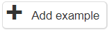
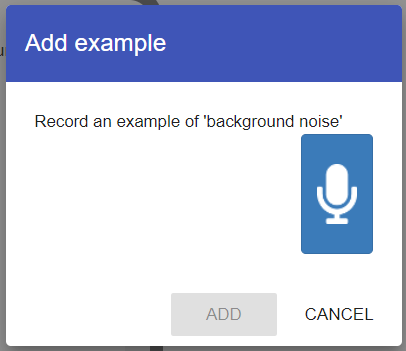

## Train the model

Imagine you're teaching a parrot to mimic certain words. You say "left", and you want the parrot to repeat "left". At first, the parrot might not get it right, maybe it squawks or says something different. But if you keep repeating "left" to the parrot and encourage it when it gets it right, eventually it will start saying "left" back to you. The same goes for "right", "up", and "down". After some time, whenever you say one of these words, the parrot will repeat it perfectly.

Training an audio classifier is a lot like teaching this parrot, but with a computer instead of a feathery friend. We want the computer to recognize the words 'left', 'right', 'up', and 'down'. So, we repeatedly "tell" the computer these words and correct it if it gets them wrong. After a while, just like the parrot, the computer will be able to identify these words whenever it "hears" them.

--- task ---

Select **Add new label** and create a label for the `up` class.

--- /task ---

--- task ---

**Repeat** the above step to create more labels for each of the `down`, `left` and `right` classes.

--- /task ---

--- task ---

Inside the `up` class, click `Add Example`. 

--- /task ---

--- task ---

Record a sample of yourself (and anyone else you like!) saying `up` by clicking the microphone. 
**Note:** You can only record a maximum of 2 seconds in each sample.

--- collapse ---
---
title: Some tips for recording your voice
---

Imagine you're teaching a new word to a friend from another country. Sometimes you might say the word slowly and clearly, and other times you might say it quickly or in your everyday speaking style. This helps your friend understand the word no matter how it's said. Recording your voice for the audio classifier is similar!

+ Find a Quiet Spot: Just like finding the best place to teach your friend the new word, pick a spot where there's no background noise. This helps the computer focus on just your voice.

+ Speak Clearly... But Not Always: Start by saying "left", "right", "up", and "down" very clearly. But also, mix it up! Sometimes say them quickly, or the way you'd say them in a regular conversation. This teaches the computer to recognize the words even when they're not perfectly pronounced.

+ Hold the Mic Steady: If you're using a microphone or a phone, hold it steady, about a hand's length away from your mouth. A headset mic shouldn't touch your face when you speak. Think of it as the "listening ear" that's eager to learn!

+ Not Too Loud, Not Too Soft: Speak at a normal volume. Imagine you're chatting with your friend at the park – not too shouty, but not whispering secrets either.

+ Do a Test Run: Before diving in, record a short clip and listen to it. If you can understand yourself, the computer probably can too!

By giving the computer a mix of clear and everyday pronunciations, it'll be ready to understand you in the real world, no matter how you say the words. 

--- /collapse ---

--- /task ---

--- task ---

**Record** lots of samples for each class. You must add **a minimum of 8 samples in each class**, or you can't train your model. 

--- collapse ---
---
title: How many samples should I add?
---

8 is the **very lowest** number of samples each class can have to create a working model. 

You should aim for **around 10-15 samples of each word**, but again - the more **training data** you add to your model at this stage, the more accurate it will be at recognising the words you say.

--- /collapse ---

--- /task ---

--- task ---

When you have enough samples in each class, select **Back to project**.

--- /task ---

--- task ---

Next, select **Learn & Test**.

Your model is now ready to be trained. 

--- /task ---

--- task ---

Select **Train new machine learning model**.

You will have to wait a moment while the model trains - read the information below about testing while the model is learning!

--- /task ---

### Testing your model

Now that you have trained your model, it is time to test it to see how successful it is.  

--- collapse ---
---
title: Training Data vs. Testing Data
---

To teach a computer program a specific task, we provide it with a particular set of data called **training data**. This set is similar to the exercises in a textbook that have answers; they help in understanding and practicing the topic.

After processing the training data, it's essential to check the program's performance. For this, we introduce it to a new set of data known as **testing data**. Think of this as taking a quiz or test at school: the questions aren't identical to what you practiced, but they cover the same topic.

**Why Keep Them Separate?**
If we use the same data for both training and testing, it's like giving you a maths test with the exact same questions you practised with. You might get all the answers right, but it doesn't show if you understand the topic broadly. It only shows that you know those specific questions.

Similarly, if we test the computer program with the same data it trained on, we can't be sure if it has learned the task broadly or if it just "remembers" that specific data. By using different data for testing, we can get a better idea of how well the program can handle new, unseen situations.

So, it's essential to keep training and testing data separate to ensure that the computer program can perform the task accurately in various situations, not just the ones it has seen before.

--- /collapse ---

Once the training is finished, see how successful your model is at classifying the test data. 

--- task ---

Click the `Start listening` button to test your machine learning model.

Say one of the words that you have trained the computer to recognise: "up", "down", “left” or “right”. If your machine learning model recognises it, it will show a prediction of what you said.

--- /task ---

--- task ---

If you’re not happy with how the model is working, go back to the **Train** page and add more examples to all the training buckets. Try varying your speed and pronunciation, having other people add samples in their voice... or doing funny voices yourself!

--- /task ---

--- task ---

Once you have tested a few of the images, answer the following questions in your **blueprint**:

1. Describe the results of your testing. How accurate was the model? 
2. Why do you think the prediction is sometimes  wrong?
3. How could you improve the accuracy of the model?

--- /task ---

### Bias and data

When we teach a computer to recognise different things, like dogs and cats, we need to give it lots of examples to learn from. These examples are called **training data**.

If we use a training dataset that contains mostly small dogs and large cats, this does not accurately represent the real world as there are also large dogs and small cats. If the data used to train the model is not representative of what you're trying to model,the prediction which your model makes won't be either.

This is called **bias**, which means the computer is favouring one thing over another. We can fix this by using a more diverse training dataset that includes different sizes and breeds of dogs and cats. By doing this, we can help the computer learn to recognise the features that distinguish each type of animal, rather than just relying on the size of the training examples.

Imagine you were making an app that predicted the age of people. 
  
Now think of 10 people who you could use to take photos of for your training data? What bias would you introduce? Have you picked people from a range of age groups? Would you app work with all people from all over the world with different faces and skin tones?
  
By using more diverse and representative training data, we can help ensure that the computer makes accurate and fair predictions when it encounters new examples. This can make the computer more useful and reliable for different applications, from sorting pet adoption photos to assisting veterinarians in diagnosing animal health issues.

Let's start making your machine learning application in Scratch and think about what it will do!