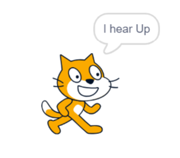
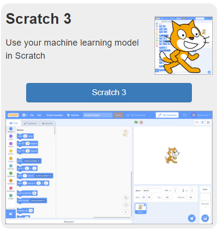
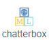
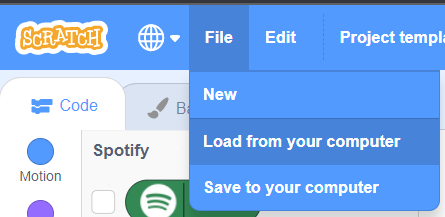

## Make a Scratch application to classify images

<div style="display: flex; flex-wrap: wrap">
<div style="flex-basis: 200px; flex-grow: 1; margin-right: 15px;">
Your model is trained and ready to test, but to do that you need to create a scratch project that can allow your user to input images and classify the input as `hotdog` or `nothotdog`.
</div>
<div>
{:width="300px"}
</div>
</div>


### **Your project will:**
+ Take audio input from the user
+ Use your trained ML model to classify sounds
+ Move a sprite on-screen based on the classification

--- task ---

On your [**project page**](https://machinelearningforkids.co.uk/#!/projects){:target="_blank"}, select **Make**:


--- /task ---

--- task ---

On the next page, select Scratch 3


--- /task ---

<div style="display: flex; flex-wrap: wrap">
<div style="flex-basis: 200px; flex-grow: 1; margin-right: 15px;">
A special fork of Scratch will open in a new tab. When it does, you will see an item in the left-hand menu with the same name as your machine learning project.

The new grey blocks you can see in that menu allow you to access your machine learning model from within your project:
</div>
<div>
{:width="100px"}
</div>
</div>

--- collapse ---
---
title: Pro tip - Save your work!
---

This special version of Scratch allows you to access your machine learning model, as well as use the music database blocks - **if you try to open your project in another version of Scratch online it won’t work**. 

A hack you can use is to save your work to your computer often. Once you have the .sb3 file for your project saved you can open it again later, or on another computer:
+ Go to [rpf.io/mlscratch](rpf.io/mlscratch){:target="_blank"} to get to this special fork of Scratch 
+ Once Scratch opens choose File > Load from your Computer
+ Select your file in the window that appears to get back to where you left off




Save your work as often as you can to make sure you don’t lose any progress!

--- /collapse ---

--- task ---

Add a `when green flag clicked`{:class="block3events"} block to your workspace. This is the script that will run the first time we start the project. 

```blocks3
when green flag clicked
```

--- /task ---

--- task ---

From the blue `Motion`{:class="block3motion"} menu, add a `set rotation style [left-right]`{:class="block3motion"} block to your script.

```blocks3
when green flag clicked
set rotation style [left-right v]
```

This will make sure your sprite doesn't flip upside-down when moving around.

--- /task ---

--- task ---

Next, drag a grey `train new machine learning model` block from the Machine learning for kids menu at the very bottom:

```blocks3
when green flag clicked
set rotation style [left-right v]
train new machine learning model :: #4b4c60
```

--- /task ---

--- task ---

Next, from the golden `Control`{:class="block3control"} menu, add a `wait until < >`{:class="block3control"} block to your script.

```blocks3
when green flag clicked
set rotation style [left-right v]
train new machine learning model :: #4b4c60
wait until <>
```

--- /task ---

--- task ---

Into the empty slot in the `wait until < >`{:class="block3control"} block, drag a round `is the machine learning model [ready to use] ?` block from the Machine Learning for kids menu at the very bottom:

```blocks3
when green flag clicked
set rotation style [left-right v]
train new machine learning model :: #4b4c60
wait until <is the machine learning model [ready to use v] ? :: #4b4c60>
```

--- /task ---

--- task ---

To the end of this script, add a grey `start listening` block from the Machine Learning for Kids menu at the very bottom:

```blocks3
when green flag clicked
set rotation style [left-right v]
train new machine learning model :: #4b4c60
wait until <is the machine learning model [ready to use v] ? :: #4b4c60>
start listening :: #4b4c60
```

--- /task ---

Your application is now ready to start listening once you click the Green Flag. Next, we need to have some instructions for the sprite to follow when the model recognises each word.

--- task ---

From the Machine Learning for Kids menu, drag in several blocks - one for each word your model is trained on:


```blocks3
when I hear left :: #4b4c60 hat
```

```blocks3
when I hear right :: #4b4c60 hat
```

```blocks3
when I hear up :: #4b4c60 hat
```

```blocks3
when I hear down :: #4b4c60 hat
```

--- /task ---

--- task ---

From the blue `Motion`{:class="block3motion"} menu, add a `change x by (10)`{:class="block3motion"} to the `when I hear left` and `when I hear right` blocks:


```blocks3
when I hear left :: #4b4c60 hat
change x by (10)
```

```blocks3
when I hear right :: #4b4c60 hat
change x by (10)
```

--- /task ---

--- task ---

Beneath the `when i hear left` block, change the value in the `change x by (10)`{:class="block3motion"} block to say **-10**:

```blocks3
when I hear left :: #4b4c60 hat
change x by ((-10))
```

```blocks3
when I hear right :: #4b4c60 hat
change x by (10)
```

--- /task ---

Your sprite can now move side to side when you say "left" or "right" - now to add controls for up and down!

--- task ---

From the blue `Motion`{:class="block3motion"} menu, add a `change y by (10)`{:class="block3motion"} to the `when I hear up` and `when I hear down` blocks:


```blocks3
when I hear up :: #4b4c60 hat
change y by (10)
```

```blocks3
when I hear down :: #4b4c60 hat
change y by (10)
```

--- /task ---

--- task ---

Beneath the `when i hear down` block, change the value in the `change y by (10)`{:class="block3motion"} block to say **-10**:

```blocks3
when I hear up :: #4b4c60 hat
change y by (10)
```

```blocks3
when I hear down :: #4b4c60 hat
change y by ((-10))
```

--- /task ---

--- task ---

**Click the green flag.** Wait for the model to be listening, and say the words "left", "right", "up", and "down".
You should see you sprite begin to move!

--- /task ---

You have now trained your own machine learning model to do speech recognition, and used that to control a character in Scratch! 

In the next step, you can customise the way your application looks by adding costumes and add some new features that activate depending on the classification of your input.

